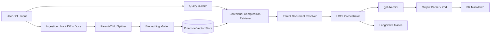

# PR Intelligence Agent

RAG-based prototype that generates **production-ready pull request descriptions** from:

- Jira ticket context (summary, description, acceptance criteria)
- Git code diff
- Internal engineering documentation

Built with **TypeScript**, **LangChain.js (LCEL)**, **OpenAI**, **Pinecone**, and **LangSmith**.

---

## Prerequisites

| Requirement | Notes |
|---|---|
| **Node.js 18+** | `node -v` to verify |
| **OpenAI API key** | Chat + embeddings |
| **Pinecone API key** | Vector store |
| **Pinecone index** | 1536 dimensions (`text-embedding-3-small`) |
| **LangSmith API key** | Optional, for tracing and evaluation evidence |

---

## Quick Start

### 1. Clone / open the project

```bash
cd pr-intelligence-agent
```

### 2. Install dependencies

```bash
npm install
```

### 3. Configure environment variables

Copy the example file and fill in your keys:

**Windows (PowerShell):**

```powershell
copy .env.example .env
```

**macOS / Linux:**

```bash
cp .env.example .env
```

Edit `.env`:

```env
OPENAI_API_KEY="your_openai_key"
PINECONE_API_KEY="your_pinecone_key"
PINECONE_INDEX_NAME="pr-intelligence-docs"

# Optional — LangSmith tracing
LANGCHAIN_TRACING_V2="true"
LANGCHAIN_API_KEY="your_langsmith_key"
LANGCHAIN_PROJECT="pr-intelligence-agent"
```

> LangSmith tracing is enabled only when `LANGCHAIN_API_KEY` is set. If it is empty, tracing is disabled automatically.

### 4. Create the Pinecone index (first time only)

```bash
npm run setup:pinecone
```

This creates index `pr-intelligence-docs` with **1536 dimensions** (cosine metric).

**Alternative:** reuse an existing index from your course project by setting:

```env
PINECONE_INDEX_NAME="langchain-docs"
```

### 5. Index sample documents

```bash
npm run index
```

Indexes mock Jira ticket, code diff, and internal docs from `data/samples/` into Pinecone.

Expected output:

```text
Indexing 7 child chunks into Pinecone index "pr-intelligence-docs"...
Indexing complete.
```

### 6. Generate a PR description

```bash
npm run generate
```

Expected output: markdown PR with **Summary**, **Changes**, **Test Plan**, **Risks**, and **Rollout Notes**.

### 7. Run the evaluation suite (optional)

```bash
npm run eval
```

Runs 3 automated cases (baseline, prompt injection, zero-retrieval fallback) and writes a report to `eval/reports/`.

---

## Available Scripts

| Command | Description |
|---|---|
| `npm run setup:pinecone` | Create Pinecone index (first-time setup) |
| `npm run index` | Index sample docs into Pinecone |
| `npm run generate` | Generate PR description from sample inputs |
| `npm run eval` | Run evaluation suite + save JSON report |
| `npm run typecheck` | TypeScript type check |
| `npm run build` | Compile to `dist/` |
| `npm run docs:pdf` | Generate TDD PDF (`docs/PR-Intelligence-Agent-TDD.pdf`) |

---

## Sample Input Data

The prototype uses mock files under `data/samples/`:

| File | Purpose |
|---|---|
| `data/samples/jira-ticket.json` | Jira ticket ENG-1427 (payment webhook retry) |
| `data/samples/code.diff` | Code diff for webhook handler |
| `data/samples/docs/architecture-guide.md` | Internal billing architecture notes |

To test another scenario, edit these files and re-run `npm run index` then `npm run generate`.

---

## Project Structure

```text
pr-intelligence-agent/
├── src/
│   ├── chains/          # LCEL PR generation pipeline
│   ├── cli/             # CLI entry points (index, generate, eval)
│   ├── config/          # Environment + Pinecone helpers
│   ├── indexing/        # Parent-child split + vectorization
│   ├── ingestion/       # Load Jira, diff, docs
│   ├── retrieval/       # Compression + parent doc resolver
│   ├── eval/            # Evaluation cases + scoring
│   └── types/
├── data/samples/        # Mock input data
├── docs/
│   ├── TDD.md           # Technical Design Document (source)
│   ├── evaluation.md    # LangSmith evidence guide
│   └── images/          # LangSmith screenshots for TDD
├── eval/reports/        # Evaluation JSON reports
├── .env.example
└── README.md
```

---

## Architecture Overview



**Data flow:** User → Embedding → Vector Store → LLM → Output Parser

---

## Key Features

- **LCEL orchestration** (`RunnableSequence`) for deterministic pipelines
- **Parent Document Retrieval** — small chunks for search, large parents for context
- **Contextual Compression** — reduces tokens and latency
- **Structured output** — Zod-validated JSON → markdown PR
- **Prompt injection defenses** — delimiter boundaries + security rules (prompt v3)
- **Zero-result fallback** — conservative output when retrieval returns nothing
- **LangSmith tracing** — evaluation tags and metadata for before/after comparison

---

## Troubleshooting

### Pinecone 404 — index not found

```text
Pinecone index "pr-intelligence-docs" was not found (HTTP 404)
```

**Fix:**

```bash
npm run setup:pinecone
```

Or set `PINECONE_INDEX_NAME` to an existing index in `.env`.

### LangSmith 403 Forbidden

Tracing is on but `LANGCHAIN_API_KEY` is missing or invalid.

**Fix:** set a valid key in `.env`, or leave `LANGCHAIN_API_KEY` empty to disable tracing.

### `npm run generate` produces no output

Ensure indexing completed successfully:

```bash
npm run index
npm run generate
```

### Type check

```bash
npm run typecheck
```

---

## Documentation

| Document | Location |
|---|---|
| Technical Design Document (PDF) | `docs/PR-Intelligence-Agent-TDD.pdf` |
| TDD source (Markdown) | `docs/TDD.md` |
| Evaluation guide | `docs/evaluation.md` |

---

## License

MIT
